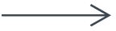

<!-- Write content Down Here :) -->

# Diagramma di Sequenza (Sequence Diagram)

## Breve introduzione all'argomento

Per capire meglio cos'è un Diagramma di Sequenza, è importante conoscere come funziona un UML. Il linguaggio UML, Unified Modeling Language, viene utilizzato per fornire un modo standard per visualizzare, documentare, specificare e costruire sistemi software.

Un Diagramma di Sequenza è un tipo di **Diagramma di interazione**, perché descrive come un gruppo di oggetti lavora insieme. I diagrammi di interazione vengono utilizzati per rappresentare il modo in cui gli oggetti nel sistema si connettono e comunicano tra loro. Questi diagrammi ci forniscono il contesto di un'interazione tra una o più **linee di vita** nel sistema. Ciò consente la visualizzazione di semplici scenari di runtime in modo grafico. I diagrammi di Sequenza sono anche chiamati _diagrammi di eventi_ o _scenari di eventi_. Di solito, questi diagrammi vengono utilizzati da professionisti aziendali e sviluppatori di software per documentare i processi o per comprendere i requisiti di un nuovo sistema.

## Quando utilizzare il Diagramma di Sequenza

Esistono scenari in cui il Diagramma di Sequenza è il miglior UML da utilizzare:

- _Scenario di utilizzo:_ uno scenario di utilizzo è un diagramma di come un sistema potrebbe essere potenzialmente utilizzato. È un ottimo modo per assicurarti di aver elaborato la logica di ogni possibile scenario per il sistema.
- _Logica del servizio:_ se un servizio viene utilizzato da client diversi, un Diagramma di Sequenza è un modo ideale per mapparlo.
- _Logica del metodo:_ proprio come potresti usare il Diagramma di Sequenza per analizzare la logica di un caso d'uso, puoi usarlo per analizzare la logica di qualsiasi funzione, procedura o processo complesso.

## Simboli e componenti di base

I diagrammi di Sequenza sono costituiti dalle seguenti icone ed elementi:

- **Simbolo base:** rappresenta una classe o un oggetto in UML. Il simbolo dell'oggetto dimostra come si comporterà un oggetto nel contesto del sistema. Gli attributi della classe non dovrebbero essere elencati in questa forma.

    

- **Casella di attivazione:** rappresenta il tempo necessario ad un oggetto per completare un'attività. Più tempo richiederà l'attività, più lunga sarà la casella di attivazione.

    

- **Attore:** mostra le entità che interagiscono o sono esterne al sistema.

    

- **Linea di vita:** rappresenta il passare del tempo mentre si estende verso il basso. La linea verticale tratteggiata mostra gli eventi sequenziali che si verificano in un oggetto durante il processo tracciato. Le linee di vita possono iniziare con una forma rettangolare etichettata o un simbolo di attore.

    

- **Ciclo a opzioni:** viene utilizzato per modellare gli scenari if/then. Ad esempio, una circostanza che si verificherà solo in determinate condizioni.

    

- **Simbolo alternativo:** simboleggia la scelta tra due o più sequenze di messaggi.

    

## Simboli dei messaggi comuni

Le seguenti frecce e simboli di messaggio vengono utilizzati per mostrare come le informazioni vengono trasmesse tra gli oggetti. Questi simboli possono riflettere l'inizio e l'esecuzione di un'operazione o l'invio e la ricezione di un segnale.

- **Messaggio sincrono:** è rappresentato da una linea continua con una freccia piena. Questo simbolo viene utilizzato quando un mittente deve attendere una risposta a un messaggio prima che continui. Il diagramma dovrebbe mostrare sia la chiamata che la risposta.

    

- **Messaggio asincrono:** è rappresentato da una linea continua con una freccia allineata. I messaggi asincroni non richiedono una risposta prima che il mittente continui. Solo la chiamata dovrebbe essere inclusa nel diagramma.

    

- **Messaggio di ritorno asincrono:** è rappresentato da una linea tratteggiata con una freccia allineata.

    

- **Creazione messaggio asincrono:** è rappresentato da una linea tratteggiata con una freccia allineata. Questo messaggio crea un nuovo oggetto.

    

- **Messaggio di risposta:** è rappresentato da una linea tratteggiata con una freccia allineata.

    

- **Eliminazione del messaggio:** è rappresentato da una linea continua con una freccia piena, seguita da una X. Questo messaggio distrugge un oggetto.

    

## Esempio nella vita reale

Di seguito è riportato un esempio di utilizzo del Diagramma di Sequenza per i sistemi ATM.

Un bancomat consente alle persone di accedere ai propri conti bancari attraverso un processo completamente automatizzato. L'esempio seguente delinea l'ordine sequenziale degli ioni di interazione nel sistema ATM.

    

